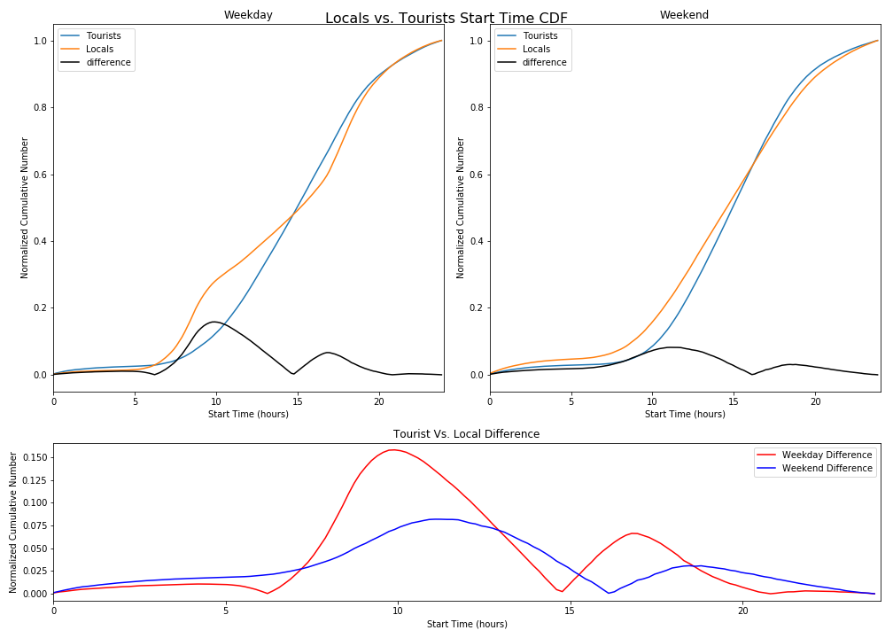

# HW 11
### Time Series Analysis & Random Forest Classifiers

**Notes:** All work was done alone.

## Assignment 1: MTA Weekly Card Swipe Data from 05/21/2010 - 194 weeks
The data source was a 3D Numpy Array (MTAfares.pny) of shape 600,23,194 and corresponded to the number of swipes for a 194 week period, per card, per station (600). This assignment was broken into 3 parts. type (23).
1. Investigate which week was an outlier (fell more than 3 standard deviations below mean)
2. What card types had the steepest increase and decrease over the given time series?
3. Build two Random Forest Classifiers to predict card type, given (1.) 4 engineered features & (2.) the entire time series.

## Assignment 2: Improve plot from HW8
Based on Rohun's feedback, I added another graph to my plot of just the two CDF differences overlayed on top of each other. I also used GridSpec to improve the visualization. I however did not plot the requested histogram because I did not feel it answered my initial question as well as my CDF's. 

