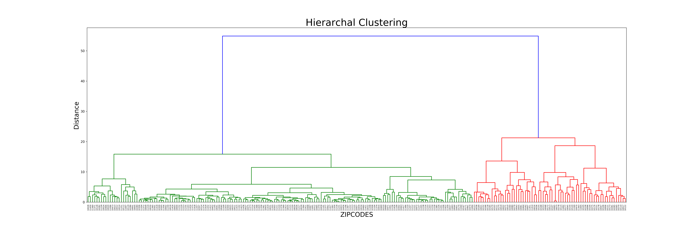

# Homework 12
### *Time Series Fourier Transformation & Clustering Techniques*

**Notes**
I worked with Pablo Mandiola and Linda Jaber on the two assignments this week.

## Assignment 1: Fourier Transformation
This was an extension of Assingment 2 from HW 11. We analyzed the 600 subway stations to see which ones had an annual periodicity in ridership.
I was successfully able to isolate 4 such stations.

## Assignment 2: Clustering through Partioning & Hierarchal Techniques
Here we analyzed business activity (establishments) for 21 years (1994-2014) in NYC zip codes.
I analyze the time series data using K-Means (Hard Partioning) clustering and Agglomerative Hierarchal clustering.
The results of each look very different and I attempt to explain why. 

