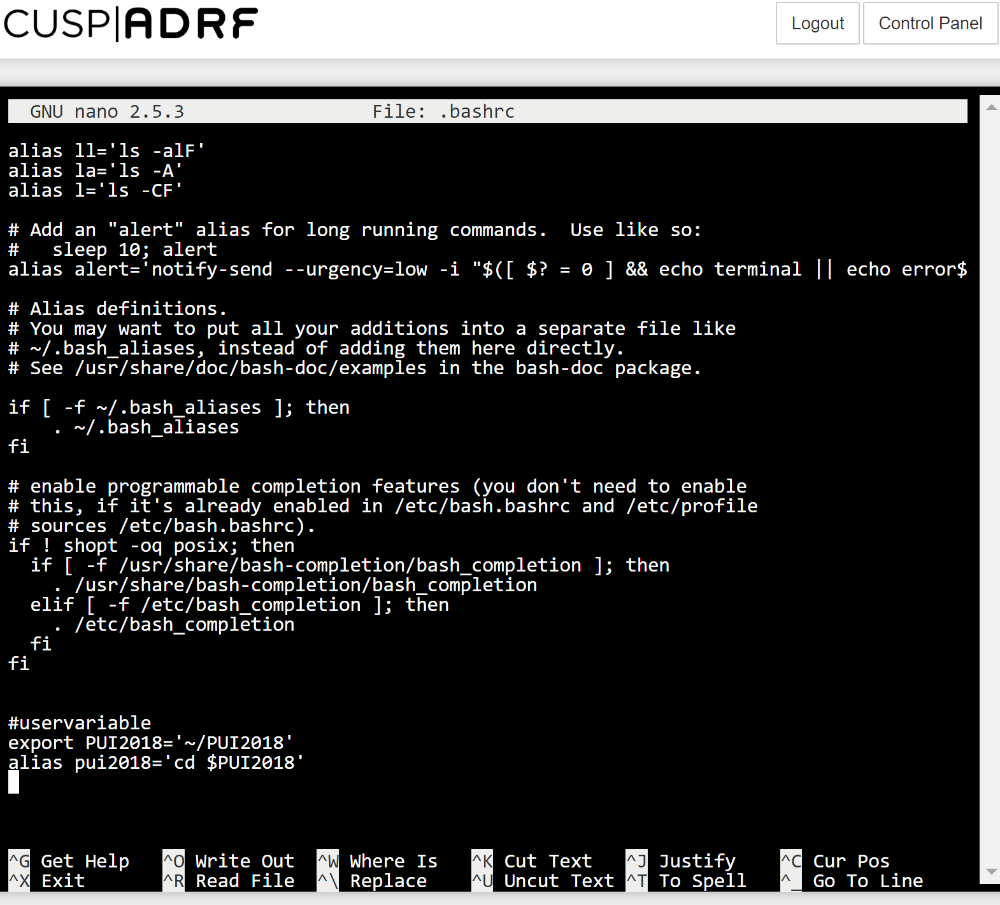

# Homework 1

*I completed this homework independently. Colin Bradley helped me figure out how to embed pictures in this README file*

## Establishing the environment variable and alias

*This is where I defined my user variable and alias*

## Calling newly defined alias within terminal (ADRF)

*This is where i called my new variable & alias within terminal*

   
